# 🔧 Implementation Guide

## 🎯 Overview

The FineTunedLLM system implements a sophisticated domain-aware fine-tuning pipeline that combines the strengths of multiple cloud AI services. This guide provides detailed technical insights into the architecture, implementation patterns, and design decisions that power our hybrid cloud approach.

### 📋 What You'll Learn

| Section | Focus | Target Audience |
|---------|-------|----------------|
| 🏗️ **System Architecture** | High-level design and component overview | Solution Architects, Tech Leads |
| 🧩 **Core Components** | Deep dive into implementation details | Senior Developers, DevOps Engineers |
| 🚀 **Serverless Deployment** | Azure Functions and infrastructure | Cloud Engineers, SREs |
| 🔄 **Data Flow Pipeline** | End-to-end processing workflow | Integration Specialists |
| 🛡️ **Security & Best Practices** | Production-ready security patterns | Security Engineers, Compliance |
| 📊 **Performance Optimization** | Scaling and cost optimization | Performance Engineers |
| 🔍 **Monitoring & Observability** | Telemetry and diagnostics | SREs, Support Teams |

### 🎯 Prerequisites

Before diving into implementation details, ensure you have:

- ✅ **Azure Subscription** with OpenAI service access
- ✅ **AWS Account** with Bedrock service permissions  
- ✅ **Python 3.9+** development environment
- ✅ **Azure CLI** and **AWS CLI** configured
- ✅ Understanding of serverless architectures
- ✅ Familiarity with AI/ML model fine-tuning concepts

## 🏗️ System Architecture

### 🌐 High-Level Architecture

Our hybrid cloud architecture leverages the best of both Azure and AWS services:

```mermaid
graph TB
    A[📄 Raw Documents] --> B[🔍 Domain Detection]
    B --> C[🧠 Claude Sonnet 4<br/>Amazon Bedrock]
    C --> D[📝 JSONL Generation]
    D --> E[⚙️ Azure OpenAI<br/>Fine-tuning]
    E --> F[🎯 Domain-Specific Model]
    
    G[☁️ Azure Functions] --> C
    G --> E
    H[💾 Azure Blob Storage] --> C
    H --> D
    I[🔐 Key Vault] --> G
    J[📊 Application Insights] --> G
```



### 🔧 Component Overview

| Component | Technology | Purpose | Documentation |
|-----------|------------|---------|---------------|
| **Training Data Generator** | Claude Sonnet 4 (Bedrock) | High-quality prompt-response pair creation | [API Reference](API.md#bedrock-integration) |
| **Fine-tuning Engine** | Azure OpenAI GPT-4 | Domain-specific model customization | [API Reference](API.md#azure-openai) |
| **Orchestration** | Azure Functions | Serverless workflow management | [Deployment Guide](DEPLOYMENT.md#azure-functions) |
| **Storage** | Azure Blob Storage | Document and model artifact storage | [Setup Guide](SETUP.md#storage-configuration) |
| **Security** | Azure Key Vault | Secure credential management | [Setup Guide](SETUP.md#security-setup) |
| **Monitoring** | Application Insights | Performance tracking and logging | [Deployment Guide](DEPLOYMENT.md#monitoring) |

### 🔄 Processing Flow

```mermaid
graph LR
    A[📄 Document Upload] --> B[🔍 Domain Detection]
    B --> C[📝 Summary Generation]
    C --> D[🎯 Training Data Creation]
    D --> E[⚙️ Model Fine-tuning]
    E --> F[🚀 Model Deployment]
```



### 🚀 Quick Implementation Example

Here's how to implement the core pipeline in just a few lines:

```python
from FineTunedLLM import DomainAwareTrainerBedrock
from FineTunedLLM.domain import DomainContextManager

# Initialize the trainer
trainer = DomainAwareTrainerBedrock(
    api_key="your-azure-openai-key",
    aws_access_key_id="your-aws-key",
    aws_secret_access_key="your-aws-secret"
)

# Process a document
document_path = "technical_api_documentation.txt"
with open(document_path, 'r') as f:
    content = f.read()

# Generate training data
training_data = trainer.generate_training_data(
    content=content,
    domain="technical",  # Auto-detected from filename
    num_examples=10
)

# Start fine-tuning
job_id = trainer.start_fine_tuning(
    training_data=training_data,
    model_name="gpt-4",
    suffix="technical-api-v1"
)

print(f"Fine-tuning job started: {job_id}")
```

> 💡 **Tip**: For production deployments, see our [Deployment Guide](DEPLOYMENT.md) for Azure Functions setup.

## 🧩 Core Components

### 1. Domain-Aware Training Pipeline

The `DomainAwareTrainerBedrock` class serves as the main orchestrator:

```python
class DomainAwareTrainerBedrock:
    """
    Main orchestrator for domain-aware fine-tuning pipeline.
    
    Responsibilities:
    - Coordinate between Bedrock and Azure OpenAI
    - Manage domain-specific context
    - Handle error recovery and retry logic
    - Monitor training progress
    """
    
    def __init__(self, api_key: str, aws_access_key_id: str, 
                 aws_secret_access_key: str, aws_region: str = "us-east-1"):
        # Initialize AWS Bedrock client
        self.bedrock_client = self._setup_bedrock_client()
        
        # Initialize OpenAI client (Azure or Standard)
        self.openai_client = self._setup_openai_client()
        
        # Initialize domain context manager
        self.domain_manager = DomainContextManager()
```

#### Key Design Patterns

1. **Strategy Pattern**: Domain-specific processing strategies
2. **Factory Pattern**: Client initialization based on configuration
3. **Observer Pattern**: Progress monitoring and event handling
4. **Retry Pattern**: Resilient API interactions with exponential backoff

### 2. Domain Context Management

The `DomainContextManager` handles domain-specific customization:

```python
class DomainContextManager:
    """
    Manages domain-specific prompts, keywords, and processing logic.
    
    Supported Domains:
    - Technical: Software, APIs, system architecture
    - Medical: Healthcare, clinical, pharmaceutical
    - Legal: Contracts, compliance, regulatory
    - Financial: Banking, investment, economic analysis
    """
    
    DOMAIN_CONTEXTS = {
        "technical": {
            "system_prompt": "You are a technical documentation specialist...",
            "focus_areas": ["APIs", "architecture", "performance", "security"],
            "keywords": ["API", "endpoint", "authentication", "database"],
            "examples": {...}
        },
        # ... other domains
    }
```

#### Domain Detection Logic

```python
def detect_domain_from_filename(self, filename: str) -> str:
    """
    Automatically detect domain from filename patterns.
    
    Detection Rules:
    - technical_*, api_*, system_* → technical
    - medical_*, clinical_*, health_* → medical
    - legal_*, contract_*, compliance_* → legal
    - financial_*, bank_*, invest_* → financial
    """
```

### 3. Abstractive Summarization with Bedrock

The `AbstractiveSummarizer` leverages Claude Sonnet 4's advanced capabilities:

```python
class AbstractiveSummarizer:
    """
    High-quality text summarization using Claude Sonnet 4 via Amazon Bedrock.
    
    Features:
    - Domain-aware summarization
    - Contextual understanding
    - Multi-document synthesis
    - Structured output generation
    """
    
    def summarize_with_domain_context(self, text: str, domain: str, 
                                    focus_areas: List[str] = None) -> str:
        # Construct domain-specific prompt
        prompt = self._build_domain_prompt(text, domain, focus_areas)
        
        # Call Claude Sonnet 4 via Bedrock
        response = self.bedrock_client.invoke_model(
            modelId="anthropic.claude-3-5-sonnet-20241022-v2:0",
            body=json.dumps({
                "anthropic_version": "bedrock-2023-05-31",
                "max_tokens": 4096,
                "messages": [{"role": "user", "content": prompt}]
            })
        )
        
        return self._extract_summary(response)
```

#### Prompt Engineering Strategy

The system uses sophisticated prompt engineering:

1. **Domain Context Injection**: Specialized system prompts for each domain
2. **Few-Shot Learning**: Domain-specific examples in prompts
3. **Structured Output**: Consistent formatting for downstream processing
4. **Focus Area Targeting**: Customizable emphasis areas

### 4. JSONL Training Data Generation

The `JsonlGenerator` creates OpenAI-compatible training data:

```python
class JsonlGenerator:
    """
    Generates high-quality training data in JSONL format using Claude Sonnet 4.
    
    Process:
    1. Chunk text into manageable segments
    2. Generate domain-specific prompt-response pairs
    3. Apply quality filtering and validation
    4. Format for OpenAI fine-tuning specifications
    """
    
    def generate_training_examples(self, text: str, domain: str, 
                                 num_examples: int = 4) -> List[Dict]:
        examples = []
        
        for i in range(num_examples):
            # Generate diverse question types
            question_type = self._select_question_type(domain, i)
            
            # Create prompt-response pair
            example = self._generate_example(text, domain, question_type)
            
            # Validate quality
            if self._validate_example(example):
                examples.append(example)
        
        return examples
```

#### Quality Assurance Mechanisms

1. **Content Validation**: Ensure responses are accurate and relevant
2. **Diversity Checks**: Prevent repetitive training examples
3. **Length Optimization**: Balance detail with token efficiency
4. **Format Compliance**: Strict adherence to OpenAI specifications

### 5. Fine-tuning with Azure OpenAI

The fine-tuning process uses Azure OpenAI's robust infrastructure:

```python
class FineTuningPipeline:
    """
    Manages the complete fine-tuning lifecycle with Azure OpenAI.
    
    Capabilities:
    - Automated file upload and validation
    - Training job orchestration
    - Progress monitoring and metrics collection
    - Model deployment and versioning
    """
    
    def start_finetuning(self, training_file: str, validation_file: str, 
                        config: FineTuningConfig) -> str:
        # Upload training files
        training_file_id = self._upload_file(training_file)
        validation_file_id = self._upload_file(validation_file)
        
        # Create fine-tuning job
        job = self.client.fine_tuning.jobs.create(
            training_file=training_file_id,
            validation_file=validation_file_id,
            model=config.model,
            hyperparameters={
                "n_epochs": config.n_epochs,
                "batch_size": config.batch_size,
                "learning_rate_multiplier": config.learning_rate_multiplier
            },
            suffix=config.suffix
        )
        
        return job.id
```

## 🚀 Serverless Deployment Architecture

### Azure Functions Implementation

The system deploys as two complementary Azure Functions:

#### 1. Summarization Pipeline Function

```python
@app.blob_trigger(arg_name="blob", path="input-documents/{name}",
                  connection="AzureWebJobsStorage")
@app.blob_output(arg_name="output_blob", path="summaries/{name}.json",
                 connection="AzureWebJobsStorage")
def process_document(blob: func.InputStream, output_blob: func.Out[str]):
    """
    Automatically processes uploaded documents using Claude Sonnet 4.
    
    Trigger: New blob in 'input-documents' container
    Output: Summary JSON in 'summaries' container
    """
    # Extract domain from filename
    domain = detect_domain_from_filename(blob.name)
    
    # Read and process document
    content = blob.read().decode('utf-8')
    summary = summarizer.summarize_with_domain_context(content, domain)
    
    # Store results
    result = {
        "original_file": blob.name,
        "domain": domain,
        "summary": summary,
        "timestamp": datetime.utcnow().isoformat(),
        "processing_metadata": {...}
    }
    
    output_blob.set(json.dumps(result, indent=2))
```

#### 2. Fine-tuning Pipeline Function

```python
@app.http_trigger(route="start-training", methods=["POST"])
def start_training(req: func.HttpRequest) -> func.HttpResponse:
    """
    Initiates fine-tuning jobs via HTTP API.
    
    Expected payload:
    {
        "training_file_blob": "path/to/training.jsonl",
        "domain": "technical",
        "config": {...}
    }
    """
    try:
        # Parse request
        req_body = req.get_json()
        
        # Download training data from blob storage
        training_data = download_blob(req_body["training_file_blob"])
        
        # Start fine-tuning job
        job_id = trainer.start_finetuning(training_data, req_body["config"])
        
        return func.HttpResponse(
            json.dumps({"job_id": job_id, "status": "started"}),
            status_code=202,
            mimetype="application/json"
        )
    
    except Exception as e:
        logging.error(f"Training start failed: {str(e)}")
        return func.HttpResponse(
            json.dumps({"error": str(e)}),
            status_code=400,
            mimetype="application/json"
        )
```

### Infrastructure as Code

The system uses Azure Bicep templates for reproducible deployments:

```bicep
// Main infrastructure template
param location string = resourceGroup().location
param environmentName string

// Storage account for documents and models
resource storageAccount 'Microsoft.Storage/storageAccounts@2023-01-01' = {
  name: '${environmentName}storage'
  location: location
  sku: {
    name: 'Standard_LRS'
  }
  kind: 'StorageV2'
  properties: {
    accessTier: 'Hot'
    allowBlobPublicAccess: false
    supportsHttpsTrafficOnly: true
  }
}

// Function Apps for serverless execution
resource summarizationFunction 'Microsoft.Web/sites@2023-01-01' = {
  name: '${environmentName}-summarization'
  location: location
  kind: 'functionapp'
  properties: {
    serverFarmId: hostingPlan.id
    siteConfig: {
      appSettings: [
        {
          name: 'FUNCTIONS_EXTENSION_VERSION'
          value: '~4'
        }
        {
          name: 'FUNCTIONS_WORKER_RUNTIME'
          value: 'python'
        }
        // ... additional configuration
      ]
    }
  }
}
```

## 🔄 Data Flow and Processing Pipeline

### End-to-End Workflow


### Processing Stages

1. **Document Ingestion**
   - Automatic domain detection from filename patterns
   - Content extraction and preprocessing
   - Quality validation and filtering

2. **Training Data Generation**
   - Text chunking with overlap handling
   - Domain-specific prompt engineering
   - Claude Sonnet 4 processing via Bedrock
   - JSONL formatting and validation

3. **Model Fine-tuning**
   - File upload to Azure OpenAI
   - Hyperparameter optimization
   - Training progress monitoring
   - Model validation and testing

4. **Deployment and Serving**
   - Model endpoint creation
   - Performance monitoring setup
   - Usage analytics configuration

## 🛡️ Security and Best Practices

### Authentication and Authorization

```python
class SecurityManager:
    """
    Centralized security management for the pipeline.
    
    Features:
    - Azure Managed Identity integration
    - API key rotation and management
    - Access control and auditing
    - Secure credential storage
    """
    
    def __init__(self):
        # Use Azure Managed Identity when available
        self.credential = DefaultAzureCredential()
        
        # Initialize Key Vault client
        self.key_vault = SecretClient(
            vault_url=os.getenv("KEY_VAULT_URL"),
            credential=self.credential
        )
    
    def get_api_key(self, service: str) -> str:
        """Retrieve API keys from Key Vault."""
        return self.key_vault.get_secret(f"{service}-api-key").value
```

### Error Handling and Resilience

```python
class ResilienceManager:
    """
    Implements retry logic and error recovery strategies.
    """
    
    @retry(
        stop=stop_after_attempt(3),
        wait=wait_exponential(multiplier=1, min=4, max=10),
        retry=retry_if_exception_type((RateLimitError, ConnectionError))
    )
    def call_api_with_retry(self, api_call: Callable, *args, **kwargs):
        """Execute API calls with intelligent retry logic."""
        try:
            return api_call(*args, **kwargs)
        except Exception as e:
            logging.warning(f"API call failed: {e}, retrying...")
            raise
```

## 📊 Performance Optimization

### Batching and Parallelization

```python
class BatchProcessor:
    """
    Optimizes processing through intelligent batching and parallelization.
    """
    
    async def process_documents_batch(self, documents: List[str], 
                                    batch_size: int = 5) -> List[str]:
        """Process multiple documents concurrently."""
        semaphore = asyncio.Semaphore(batch_size)
        
        async def process_single(doc):
            async with semaphore:
                return await self._process_document(doc)
        
        tasks = [process_single(doc) for doc in documents]
        return await asyncio.gather(*tasks)
```

### Caching Strategy

```python
class CacheManager:
    """
    Implements intelligent caching to reduce API costs and improve performance.
    """
    
    def __init__(self, cache_duration: int = 3600):
        self.cache = {}
        self.cache_duration = cache_duration
    
    def get_cached_summary(self, content_hash: str) -> Optional[str]:
        """Retrieve cached summary if available and valid."""
        if content_hash in self.cache:
            cached_item = self.cache[content_hash]
            if time.time() - cached_item['timestamp'] < self.cache_duration:
                return cached_item['summary']
        return None
```

## 🔍 Monitoring and Observability

### Application Insights Integration

```python
class TelemetryManager:
    """
    Comprehensive telemetry and monitoring for the pipeline.
    """
    
    def track_processing_metrics(self, operation: str, duration: float, 
                               success: bool, metadata: Dict):
        """Track custom metrics for performance analysis."""
        self.telemetry_client.track_metric(
            name=f"{operation}_duration",
            value=duration,
            properties={
                "success": success,
                "domain": metadata.get("domain"),
                "document_size": metadata.get("size")
            }
        )
    
    def track_cost_metrics(self, service: str, tokens_used: int, cost: float):
        """Track API usage costs for optimization."""
        self.telemetry_client.track_metric(
            name=f"{service}_cost",
            value=cost,
            properties={
                "tokens_used": tokens_used,
                "cost_per_token": cost / tokens_used if tokens_used > 0 else 0
            }
        )
```

### Health Checks and Diagnostics

```python
@app.http_trigger(route="health", methods=["GET"])
def health_check(req: func.HttpRequest) -> func.HttpResponse:
    """Comprehensive health check endpoint."""
    health_status = {
        "status": "healthy",
        "timestamp": datetime.utcnow().isoformat(),
        "version": "1.0.0",
        "services": {}
    }
    
    # Check Bedrock connectivity
    try:
        bedrock_client.list_foundation_models()
        health_status["services"]["bedrock"] = "available"
    except Exception as e:
        health_status["services"]["bedrock"] = f"error: {str(e)}"
        health_status["status"] = "degraded"
    
    # Check Azure OpenAI connectivity
    try:
        openai_client.models.list()
        health_status["services"]["openai"] = "available"
    except Exception as e:
        health_status["services"]["openai"] = f"error: {str(e)}"
        health_status["status"] = "degraded"
      return func.HttpResponse(
        json.dumps(health_status, indent=2),
        mimetype="application/json"
    )
```

## 📈 Implementation Roadmap

### Phase 1: Core Pipeline ✅
- [x] Domain-aware training data generation
- [x] Claude Sonnet 4 integration via Bedrock
- [x] Azure OpenAI fine-tuning pipeline
- [x] Basic monitoring and error handling

### Phase 2: Production Features ✅
- [x] Azure Functions serverless deployment
- [x] Blob storage integration
- [x] Key Vault security
- [x] Application Insights monitoring
- [x] Infrastructure as Code (Bicep)

### Phase 3: Advanced Features 🚧
- [ ] Multi-model ensemble fine-tuning
- [ ] Real-time model performance optimization
- [ ] Advanced cost optimization algorithms
- [ ] Custom domain adaptation frameworks

### Phase 4: Enterprise Features 🎯
- [ ] Multi-tenant isolation
- [ ] Advanced compliance and auditing
- [ ] Custom model lifecycle management
- [ ] Integration with enterprise AI platforms

## 🔗 Related Resources

| Resource | Description | Link |
|----------|-------------|------|
| 📚 **API Documentation** | Complete API reference and examples | [API.md](API.md) |
| 🛠️ **Setup Guide** | Environment configuration and prerequisites | [SETUP.md](SETUP.md) |
| 🚀 **Deployment Guide** | Production deployment instructions | [DEPLOYMENT.md](DEPLOYMENT.md) |
| 🏠 **Documentation Hub** | Central documentation navigation | [README.md](README.md) |
| 💻 **Source Code** | Complete implementation on GitHub | [FineTunedLLM Repository](../README.md) |

## 🤝 Contributing to Implementation

Found an optimization or want to contribute? Check our [Contributing Guidelines](../README.md#-contributing) for:

- 🐛 Bug fixes and performance improvements
- ✨ New feature implementations  
- 📖 Documentation enhancements
- 🧪 Test coverage improvements
- 🔒 Security enhancements

---

This implementation guide provides a comprehensive overview of the technical architecture and implementation details. The system is designed for scalability, reliability, and cost-effectiveness while maintaining high-quality output through sophisticated AI integration.

> 💡 **Next Steps**: Ready to deploy? Start with our [Setup Guide](SETUP.md) or jump directly to [Deployment](DEPLOYMENT.md) for production environments.